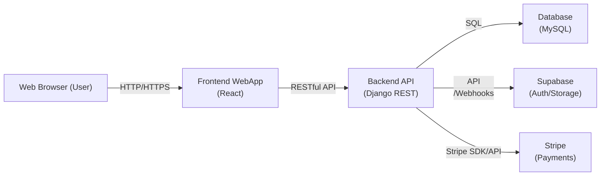
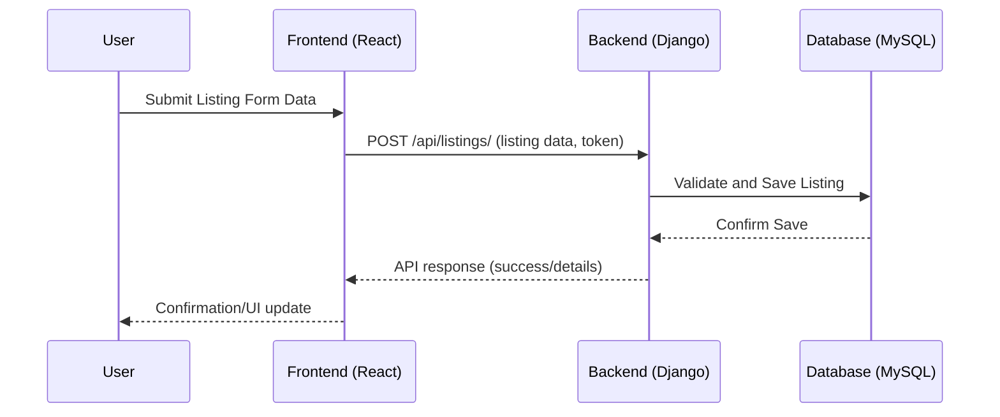

# Business Requirements Document (BRD) and Architecture Overview  
_Software Marketplace Platform_

---

## 1. Business Overview

### 1.1. Project Objective
The goal of this platform is to offer a responsive web-based marketplace for software solutions. Users (both publishers and clients) can register, submit, discover, engage with, and procure applications, with monetization and engagement handled in-platform. Both free and paid solutions are supported, with integrated authentication, engagement, and purchase/subscription features.

### 1.2. Business Goals
- Launch a curated, scalable software marketplace to increase distribution and discovery of software applications.
- Enable third-party publishers to list, manage, and monetize their software.
- Provide users with accessible search, filtering, and engagement options.
- Secure and facilitate user authentication, payment, and engagement.
- Minimize friction in onboarding and engagement to grow both sides of the marketplace.

---

## 2. User Stories

### 2.1. Visitors & Users
- As a visitor, I want to browse published applications with public details.
- As a user, I want to register (with manual or OAuth options) and manage my account.
- As a user, I want to search and filter software by criteria such as publisher, date, application type, and cost (free/paid).
- As a user, I want to view applications in an attractive card view with summary, title, author, and like count.
- As a user, I want to like/favorite solutions and see popularity statistics.
- As a user, I want to purchase or subscribe to solutions (with Stripe).
- As a user, I want to engage directly with publishers for support or inquiries.

### 2.2. Publishers
- As a publisher, I want to register/login to my account.
- As a publisher, I want to submit new software listings with relevant metadata (type, title, summary, links, status, pricing).
- As a publisher, I want to update or remove my listings.
- As a publisher, I want to see engagement analytics and handle user inquiries/purchases efficiently.

---

## 3. Key Features

- **Authentication**: Supports manual registration and OAuth (Google, GitHub).
- **Listing Management**: Submission, editing, removal, and analytics for software listings.
- **Marketplace Browse/Search/Filter**: Faceted filtering, search by multiple criteria.
- **Card View**: Clean, modern, responsive presentation for each application.
- **Likes/Favorites**: Users can like software, visible like counts, basic popularity signals.
- **Engagement Mechanisms**: In-app message/engagement requests to publishers.
- **Purchasing/Subscriptions**: Integration with Stripe for transactions (for paid apps).
- **Responsive UI**: Mobile/tablet/desktop support, modern green pastel color palette.
- **Header/Footer**: Consistent navigation and information branding.
- **3rd-Party Integrations**: Supabase (authentication or storage as needed), Stripe (payments).

---

## 4. System Containers & Roles

| Container Name         | Type         | Description                                            | Technology                 |
|-----------------------|--------------|--------------------------------------------------------|----------------------------|
| marketplace_frontend  | Frontend     | Web UI, user interactions, API requests                | React                      |
| backend               | Backend API  | Business logic, API endpoints, auth/engagement/payment | Django (REST Framework)    |
| marketplace_database  | Database     | Data storage: users, listings, likes, transactions     | MySQL, SQL interface       |
| 3rd-Party Integrations| Services     | Payments/Subscriptions, Auth/Storage                   | Stripe, Supabase           |

#### Summary of Roles:
- _Frontend_: Renders UI for end-users, manages theme, requests and displays marketplace data, handles authentication, triggers purchases, and so on.
- _Backend_: Handles API requests, business logic, authentication/authorization logic, integrations (Stripe/Supabase), and data mediation.
- _Database_: Stores all persistent data (user profiles, listings, likes, transactions, engagement logs).
- _Supabase_: Potentially for authentication or auxiliary storage or event subscription.
- _Stripe_: Handles payment and subscription workflows.

---

## 5. Main Workflows

### 5.1. User Authentication
- Users can register/login using email/password or OAuth (Google, GitHub).
- Token/session management handled by backend, leveraging Django auth and potentially Supabase.
  
### 5.2. Software Listing Submission and Management
- Authenticated users (publishers) access listing form.
- Listing data captured (type, dates, title, summary, links, paid/free).
- Backend validates, saves to database, updates listing.
- Listing management UI displays per-publisher dashboard.

### 5.3. Marketplace Browsing, Filtering, and Search
- Unauthenticated/guest users may browse all public listings.
- Search box and sidebar filters allow narrowing by publisher, date, paid/free, type.
- Frontend sends filter/search queries to backend API.
- Backend queries, filters, and paginates; returns results to frontend for rendering.

### 5.4. Engagement and Likes
- Users can like software (one like per user per listing), with backend recording like and updating count/statistics.
- Users can initiate engagement with publisher (e.g., via message or form), backend forwards/integrates with publisher logic (internal messaging or notification).

### 5.5. Purchasing/Subscription (for Paid Applications)
- User clicks "Buy" or "Subscribe".
- Backend initiates Stripe checkout/session, returns payment intent/URL.
- On successful transaction, backend updates access/ownership records and notifies the publisher.

---

## 6. High-Level Data Flow

1. **Frontend** interacts with **Backend** via RESTful API.
2. **Backend** authenticates requests and manages business workflows.
3. **Backend** reads/writes from **Database** (MySQL).
4. **Backend** communicates with **Stripe** for transactions and **Supabase** for auth/storage as configured.
5. **Frontend** presents data, handles UI state, and securely stores client-side tokens.

---

## 7. Component and Endpoint Structure

### 7.1. Frontend (React)
- Views: Marketplace/Home, Listing Detail, Publisher Dashboard, Sign In/Sign Up, Engagement Modal, Payment UI, Filters/Sidebar, Header, Footer.
- API client: Handles REST API integration and authenticating requests (token passing).

### 7.2. Backend (Django REST)
- **/api/auth/**: Register, login (manual/OAuth), logout, session/token management
- **/api/listings/**: CRUD for software listings
- **/api/marketplace/**: Listings search/filter endpoint
- **/api/likes/**: Like/unlike endpoints
- **/api/engage/**: Engage/initiate contact endpoint
- **/api/purchase/**: Purchase/subscription initiation, Stripe session endpoints
- **/api/user/**: Profile, purchased items, management endpoints

### 7.3. Database (MySQL)
- Tables (likely):
  - users
  - listings
  - likes
  - transactions
  - engagement_records
  - (Auxiliary: oauth_accounts, listing_types, etc.)

---

## 8. System Diagrams

### 8.1. Container Architecture Diagram

### 8.2. High-Level Data Flow Example: Listing Submission

---

## 9. 3rd-Party Integrations

- **Supabase**: (For authentication, user management, or file storage.) API integration from backend, with secure token passing.
- **Stripe**: (For payment/subscription workflow.) Integration is backend-centric—frontend triggers backend endpoint; backend securely interacts with Stripe.

---

## 10. Security and Compliance

- Authentication tokens are securely managed and validated for each request.
- Sensitive operations (listing creation, purchase, engagement) require auth.
- Payment data handled only by Stripe (PCI-compliant).
- Data at rest stored securely in MySQL database.
- CORS properly configured for frontend-backend communication.
- GDPR/data protection best practices assumed (deletion, privacy, logs).

---

## 11. Scalability and Extensibility

- Components (frontend/backend/database) are containerized for deployment flexibility.
- Database schema allows normalization and future expansion (multi-type listings, advanced analytics).
- Modular backend APIs for easy addition of new endpoints/integrations.
- UI built with reusable React components and CSS variables for theming.

---

## 12. Key Product/Architecture Requirements

- Responsive, modern, and accessible web UI.
- Public listings browseable; private actions require login.
- End-to-end flows for listing, search, engagement, and purchase must be seamless.
- All key user actions must be auditable and loggable by the backend.

---

## 13. References

- [React Documentation](https://reactjs.org/)
- [Django REST Framework](https://www.django-rest-framework.org/)
- [Supabase](https://supabase.com/docs)
- [Stripe API](https://stripe.com/docs/api)
- [MySQL Documentation](https://dev.mysql.com/doc/)
